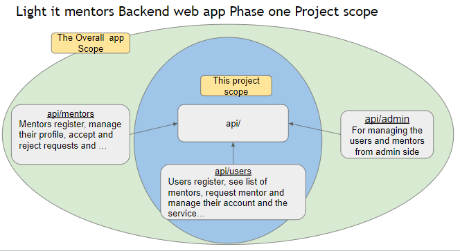

**Light it Mentors Backend web-App Phase I**
**List of Content**
- [Introduction to Light It Mentors](#introduction-to-light-it-mentors)
- [Scope of This Project](#scope-of-this-project)
- [Setup Instructions](#setup-instructions)
- [Overview of the Project Architecture](#overview-of-the-project-architecture)
  - [Project Structure](#project-structure)
  - [Main Components](#main-components)
  - [Workflow](#workflow)
  - [Dependencies](#dependencies)
- [API Endpoint Documentation](#api-endpoint-documentation)
  - [POST /users](#endpoint-post-users)
  - [GET /users/:id](#endpoint-get-usersid)
  - [PUT /users/:id](#endpoint-put-usersid)
  - [DELETE /users/:id](#endpoint-delete-usersid)
  - [POST /users/login](#endpoint-post-userslogin)
  - [GET /mentors](#endpoint-get-mentors)
  - [GET /mentors/:id](#endpoint-get-mentorsid)
  - [POST /mentor_request](endpoint-POST-mentor_request)
  - [GET /mentor_request/:id](#endpoint-get-mentor_requestid)
  - [GET /mentor_request/:id/:status](#endpoint-put-mentor_requestidstatus)

# Light it Mentors Backend web-App Phase I

## Intrioducton to Ligh it
Light It PLC is a forward-thinking startup in Ethiopia dedicated to addressing the educational and developmental challenges faced by the younger generation. By offering a comprehensive suite of services, including mentorship, structured events, and engaging content, Light It PLC aims to bridge the gap in the current education system and provide holistic guidance to children and youth. Leveraging modern technology, such as web and mobile applications, the company fosters a supportive community for students, parents, and educators, ensuring that every child has the tools to define and achieve their ambitions.

## Scope of this project
The first phase of the "Light It Mentors" backend web app focuses on developing the core APIs to connect users with mentors.

**Included in the Project Scope:**

-   **API Development:**
    -   **api/users:** Users can register, view the list of available mentors from an existing database, request a mentor, and manage their accounts and services.
    -   **api:** This serves as the central connection point between users and mentors.

**Excluded from the Project Scope:**

-   **Mentor Functionality:** The mentor-related functionality, such as registration, profile management, and handling user requests, is excluded. The project assumes that the database of mentors already exists, and the focus is on facilitating connections between users and mentors.
-   **api/admin:** APIs for managing users and mentors from the admin side are also excluded from this phase.

## Setup Instructions

1.  **Ensure Environment Variables are Configured**
    -   Create a .env file in the root of your project directory if it doesn't already exist.
    -   Add the necessary environment variables such as ACCESS_TOKEN_SECRET for JWT token signing. For example:
        env
        ACCESS_TOKEN_SECRET=your_secret_key

    -   Make sure to replace your_secret_key with your actual secret key.
2.  **Install Dependencies**
    -   Make sure all dependencies are installed. Run the following command in your project directory:

        bash
        npm install

3.  **Dependencies:**
    -   **bcrypt**: Used for hashing passwords.
    -   **dotenv**: Loads environment variables from a .env file.
    -   **express**: Web framework for building the API.
    -   **jsonwebtoken**: For creating and verifying JWT tokens.
    -   **mongoose**: MongoDB object modeling tool for Node.js.
    -   **nodemailer**: Module for sending emails.
    -   **sha1**: Hashing function.
    -   **Validator**: For validating input data.

        **DevDependencies:**

    -   **@eslint/eslintrc**: ESLint configuration package.
    -   **@eslint/js**: ESLint JavaScript rules.
    -   **eslint**: Linting utility for identifying and reporting on patterns in JavaScript.
    -   **eslint-config-airbnb-base**: ESLint configuration based on Airbnb's style guide.
    -   **eslint-plugin-import**: Plugin to support linting of ES6+ (ES2015+) import/export syntax.
    -   **eslint-plugin-jest**: Linting rules for Jest tests.
    -   **globals**: Defines global variables for linting.
    -   **nodemon**: Utility that monitors for changes in files and automatically restarts the server.
4.  **Run the Server**
    -   You can start your server using nodemon. The script provided in your package.json can be run with:

        bash
        npm run start-server

    -   This will start the server and watch for any changes, restarting automatically as needed.
5.  **Testing the Endpoint**
    -   **POST /users/login**: This endpoint requires a JSON body with email and password. Make sure to send a POST request with these fields to test the endpoint. You can use tools like Postman or curl for this.
        -   Example curl request:

            bash
            curl -X POST http://localhost:5000/users/login \\
            \-H "Content-Type: application/json" \\
            \-d '{"email": "user@example.com", "password": "userpassword"}'

6.  **Linting and Code Quality**
    -   Run ESLint to check for code quality and style issues. Use the following command:

        bash
        npx eslint .

    -   This will lint all files in your project directory based on the rules specified in your ESLint configuration.
7.  **Additional Configuration (if needed)**
    -   Make sure you have MongoDB running if your application interacts with it. You may need to set up MongoDB locally or use a cloud service.
    -   Ensure your server.js file (or the main entry point) is correctly configured to connect to MongoDB and set up routes.

With these steps, you should be able to set up and run the API endpoint. If you encounter any issues, make sure to check the logs and error messages for more details.

## Usage Guidelines

**Overview:** This backend app provides endpoints for user management and mentor requests. To interact with the app, follow these guidelines:

1.  **Create an Account:**
    -   **Endpoint:** POST /users
    -   **Description:** Register a new user by providing email, name, fatherName, and password in the request body.
    -   **Example Request:**

        json
        {
        "email": "user@example.com",
        "name": "John Doe",
        "fatherName": "Doe Senior",
        "password": "password123"
        }

2.  **Login:**
    -   **Endpoint:** POST /users/login
    -   **Description:** Authenticate the user with email and password. On successful login, receive an access token.
    -   **Example Request:**

        json
        {
        "email": "user@example.com",
        "password": "password123"
        }

    -   **Response:** Includes a JWT access token.
3.  **Access Endpoints with Authorization:**
    -   **Authorization:** Use the JWT access token in the Authorization header with the Bearer prefix.
    -   **Example Header:**

        makefile
        Authorization: Bearer your_jwt_token

4.  **Available Endpoints:**
    -   **Mentor Management:**
        -   **List Mentors:** GET /mentors
        -   **Get Mentor by ID:** GET /mentors/:id
    -   **User Management:**
        -   **Get User by ID:** GET /users/:id
        -   **Update User:** PUT /users/:id
        -   **Delete User:** DELETE /users/:id
    -   **Mentor Requests:**
        -   **Create Mentor Request:** POST /mentor_request
            -   **Description:** Submit a request for a mentor. An email is sent to the mentor with details and links for accepting or rejecting the request.
            -   **Example Request:**

                json
                {
                "mentorId": "mentor_id",
                "userId": "user_id",
                "menteeFullName": "Jane Doe",
                "location": "New York",
                "message": "Looking forward to your mentorship!"
                }

            -   **Email Details:** Upon request submission, an email is sent to the mentor containing:
                -   **Accept Request Link:** Allows the mentor to accept the request.
                -   **Reject Request Link:** Allows the mentor to reject the request.
        -   **Get Mentor Request by ID:** GET /mentor_request/:id
            -   **Description:** Retrieve details of a specific mentor request.
5.  **General Notes:**
    -   **Error Handling:** If you encounter issues such as missing data or invalid credentials, appropriate error messages will be returned.
    -   **Security:** Always protect sensitive information and handle tokens securely.
    -   **Testing:** Use tools like Postman or curl to test endpoints. Ensure proper functionality with valid and invalid inputs.

By following these guidelines, users can interact with the backend app effectively, manage mentors, handle user accounts, make mentor requests, and receive relevant notifications.

## Overview of the Project Architecture

### **1. Project Structure:**

The project is designed to support a mentorship platform with various functionalities for managing users, mentors, and mentor requests. The architecture includes:

-   **Backend Framework:**
    -   **Express.js** is used to build the RESTful API endpoints.
    -   **Node.js** as the runtime environment for executing JavaScript server-side code.
-   **Database:**
    -   **MongoDB** is used for data storage, with Mongoose as the ODM (Object Data Modeling) library for schema definition and data manipulation.
-   **Authentication:**
    -   **JWT (JSON Web Tokens)** is used for user authentication and authorization.
    -   Users must authenticate to receive an access token, which is required for accessing protected endpoints.

### **2. Main Components:**

-   **Server Setup:**
    -   **server.js**: Entry point for the application. Sets up the Express server, connects to MongoDB, and configures middleware.
-   **Models:**
    -   **User Model:** Defines the schema for user data, including authentication information.
    -   **Mentor Model:** Defines the schema for mentor details.
    -   **MentorRequest Model:** Defines the schema for requests made by users to mentors.
-   **Routes and Controllers:**
    -   **Routes:** Define API endpoints for user and mentor management, and mentor requests. Example routes include /users, /mentors, and /mentor_request.
    -   **Controllers:** Implement the business logic for handling requests and interacting with the database. Controllers include methods for creating, retrieving, updating, and deleting data.
-   **Authentication Middleware:**
    -   **JWT Authentication:** Middleware to protect routes and ensure only authenticated users can access specific endpoints.
-   **Email Integration:**
    -   **Nodemailer:** Used to send email notifications to mentors when a request is made, including links for accepting or rejecting the request.

### **3. Workflow:**

1.  **User Registration and Login:**
    -   Users register by providing their details. On successful registration, they can log in to obtain a JWT access token.
    -   The token is used for authenticating requests to protected endpoints.
2.  **Mentor Management:**
    -   Users and admins can view a list of mentors or get details of a specific mentor.
    -   Mentor details are retrieved and presented based on mentor IDs.
3.  **Mentor Requests:**
    -   Users can submit requests to mentors. The request details are stored in the database, and an email notification is sent to the mentor.
    -   Mentors can accept or reject requests through links in the email, which update the request status in the database.
4.  **Error Handling and Responses:**
    -   The system handles various error scenarios, such as missing data or invalid credentials, and returns appropriate error messages and status codes.

### **4. Dependencies:**

-   **Core Dependencies:**
    -   bcrypt: For password hashing.
    -   dotenv: For managing environment variables.
    -   express: For building the API.
    -   jsonwebtoken: For generating and verifying JWTs.
    -   mongoose: For interacting with MongoDB.
    -   nodemailer: For sending emails.
    -   sha1, Validator: For additional utility functions and validations.
-   **Development Dependencies:**
    -   eslint: For code linting and maintaining code quality.
    -   nodemon: For auto-reloading during development.

**5. Deployment:**

-   The application is configured to be deployed in a Node.js environment, typically on a server or cloud platform.

This architecture ensures a scalable, maintainable backend system for managing users, mentors, and mentor requests, with secure authentication and effective communication through email notifications.

## **API Endpoint Documentation**

### Endpoint: POST /users

**Description:**

Creates a new user in the system. Requires user details to be provided in the request body. Validates the input data, checks for existing users with the same email, hashes the password, and saves the new user to the database.

**Request Body:**

-   email (string, required): The user's email address. Must be a valid email format.
-   name (string, required): The user's full name.
-   fatherName (string, required): The user's father's name.
-   password (string, required): The user's password.

**Request:**

http
POST /users
Content-Type: application/json
{
"email": "user@example.com",
"name": "John Doe",
"fatherName": "Michael Doe",
"password": "securepassword123"
}

**Responses:**

-   **200 OK**: If the user is successfully created. Returns the email and ID of the new user.
-   **400 Bad Request**: If any required parameter is missing, or if the email is invalid, or if a user with the same email already exists.
-   **500 Internal Server Error**: If an unexpected error occurs during the process.

**Success Response:**

json
{
"email": "user@example.com",
"id": "60b6c8f8a9b0c3d6f8e4c2b4"
}
**Error Responses:**

-   Missing Email:

json
{
"error": "Missing email"
}

-   Missing Name:

json
{
"error": "Missing name"
}

-   Missing Father Name:

json
{
"error": "Missing fatherName"
}

-   Missing Password:

json
{
"error": "Missing user password"
}

-   Invalid Email:

json
{
"error": "Invalid Email"
}

-   User Already Exists:

json
{
"error": "user exists"
}

**Process Flow:**

1.  **Log Access**: Logs the access of the endpoint for monitoring purposes.
2.  **Data Validation**:
    -   Checks if all required parameters (email, name, fatherName, password) are provided.
    -   Validates the email format using validator.isEmail.
3.  **Check for Existing User**:
    -   Searches the database to see if a user with the provided email already exists.
    -   If a user with the same email is found, returns an error indicating that the user already exists.
4.  **Password Hashing**:
    -   Hashes the user’s password using bcrypt with a salt round of 10.
5.  **Save New User**:
    -   Creates a new User object and saves it to the database.
    -   Returns the email and ID of the newly created user.
6.  **Error Handling**:
    -   Catches and logs any errors during the process, returning appropriate error responses if needed.

**Additional Notes:**

-   **Password Security**: Ensure that password hashing is implemented securely with a strong hashing algorithm and sufficient salt rounds.
-   **Email Validation**: The email validation should ensure that the email format is correct but does not check for the existence of the email in a real email system.
-   **Error Logging**: Error messages are logged for debugging purposes. Ensure that sensitive information is not exposed in logs.

### Endpoint: GET /users/:id

**Description:**

Retrieves detailed information about a specific user identified by their id. Excludes sensitive information such as the password from the response.

**URL Parameters:**

-   id (string): The unique identifier of the user.

**Request:**

http
GET /users/:id
**Responses:**

-   **200 OK**: If the user details are successfully retrieved. Returns user information excluding the password.
-   **400 Bad Request**: If no user is found with the provided id.
-   **500 Internal Server Error**: If an unexpected error occurs during the process.

**Success Response:**

json
{
"user": {
"_id": "60b6c8f8a9b0c3d6f8e4c2b4",
"email": "user@example.com",
"name": "John Doe",
"fatherName": "Michael Doe",
"profileImage": "http://localhost:5000/profileImage/profile1.jpg",
"city": "Addis Ababa",
"location": "Bole",
"rating": 4.5
}

}
**Error Response:**

-   User Not Found:

json
{
"error": "user not found"
}

-   Server Error:

json
{
"error": "server error occurred"
}

**Process Flow:**

1.  **Log Access**: Logs the access of the endpoint for monitoring purposes.
2.  **Retrieve User**:
    -   Extracts the id from the URL parameters.
    -   Retrieves the user details from the database using the provided id.
3.  **User Existence Check**:
    -   If no user is found with the given id, returns a 400 status code with an appropriate error message.
4.  **Remove Sensitive Information**:
    -   Converts the user document to a plain object using user.toObject().
    -   Deletes the password field from the user object to prevent exposure of sensitive information.
5.  **Success Response**:
    -   Returns the user details excluding the password with a 200 status code.
6.  **Error Handling**:
    -   Catches and logs any errors, returning a 500 server error response if needed.

**Additional Notes:**

-   **Data Privacy**: Ensure that sensitive information like passwords is always excluded from responses to protect user privacy.
-   **Error Logging**: Errors are logged for debugging purposes, but care should be taken not to expose sensitive information in the logs.

### Endpoint: PUT /users/:id

**Description:**

Updates the details of a specific user identified by their id. Allows modifications to user data, subject to validation rules.

**URL Parameters:**

-   id (string): The unique identifier of the user to be updated.

**Request Body:**

-   name (string, optional): The updated name of the user.
-   fatherName (string, optional): The updated father's name of the user.
-   email (string, optional): The updated email address of the user. Must be a valid email format.
-   profileImage (string, optional): The URL of the updated profile image.
-   city (string, optional): The updated city of the user.
-   location (string, optional): The updated location of the user.
-   rating (number, optional): The updated rating of the user.

**Request:**

http
PUT /users/:id
Content-Type: application/
json
{
"name": "John Doe",
"fatherName": "Michael Doe",
"email": "newemail@example.com",
"profileImage": "http://localhost:5000/profileImage/newprofile.jpg",
"city": "Addis Ababa",
"location": "Bole",
"rating": 4.7
}

**Responses:**

-   **200 OK**: If the user details are successfully updated.
-   **404 Not Found**: If no user is found with the provided id.
-   **500 Internal Server Error**: If an unexpected error occurs during the update process.

**Success Response:**

json
{
"message": "user updated successfully"
}

**Error Responses:**

-   User Not Found:

json
{
"error": "user not found"
}

-   Server Error:

json
{
"error": "server error occurred"
}

**Process Flow:**

1.  **Log Access**: Logs the access of the endpoint for monitoring purposes.
2.  **Check User Existence**:
    -   Retrieves the user from the database using the provided id.
    -   If no user is found, returns a 404 status code with an appropriate error message.
3.  **Update Data**:
    -   Extracts the update data from the request body.
    -   Updates the user document in the database with the new data using User.updateOne().
    -   The upsert option is set to false to prevent creating a new document if the user does not exist.
    -   The runValidators option ensures that the update data is validated according to the schema.
4.  **Success Response**:
    -   Returns a success message with a 200 status code indicating that the user was updated successfully.
5.  **Error Handling**:
    -   Catches and logs any errors that occur during the process, returning a 500 server error response if needed.

**Additional Notes:**

-   **Validation**: Ensure that the update data adheres to the schema validation rules.
-   **Error Logging**: Errors are logged for debugging purposes, but sensitive information should be excluded from logs.

### Endpoint: DELETE /users/:id

**Description:**

Deletes a specific user identified by their id from the database.

**URL Parameters:**

-   id (string): The unique identifier of the user to be deleted.

**Request:**

-   **Method**: DELETE
-   **URL**: /users/:id
-   **Headers**:
    -   Content-Type: application/json

**Responses:**

-   **200 OK**: If the user is successfully deleted.
-   **404 Not Found**: If no user is found with the provided id.
-   **500 Internal Server Error**: If an unexpected error occurs during the deletion process.

**Success Response:**

json
{
"message": "User deleted successfully"
}

**Error Responses:**

-   User Not Found:

json
{
"error": "User not found"
}

-   Server Error:

json
{
"error": "Server error occurred"
}

**Process Flow:**

1.  **Log Access**: Logs the access of the endpoint for monitoring purposes.
2.  **Delete Operation**:
    -   Performs the delete operation using User.deleteOne() with the specified id.
    -   The deleteOne() method attempts to delete the document matching the \_id from the database.
3.  **Check Deletion Result**:
    -   Checks the result of the delete operation to determine if a document was deleted.
    -   If result.deletedCount is 0, this indicates that no document was found with the provided id, and a 404 status code is returned.
4.  **Success Response**:
    -   If a document was successfully deleted, returns a success message with a 200 status code.
5.  **Error Handling**:
    -   Catches and logs any errors that occur during the deletion process, returning a 500 status code if needed.

**Additional Notes:**

-   **Validation**: The request assumes the id provided is valid and formatted correctly.
-   **Error Logging**: Errors are logged for debugging purposes, but sensitive information should be excluded from logs.

### Endpoint: POST /users/login

**Description:**

Authenticates a user by verifying their email and password, and returns a JSON Web Token (JWT) upon successful login.

**Request Body:**

-   **Content-Type**: application/json
-   **Body Parameters**:
    -   email (string): The email address of the user attempting to log in.
    -   password (string): The password of the user attempting to log in.

**Request Example:**

json
{
"email": "user@example.com",
"password": "userpassword123"
}

**Responses:**

-   **200 OK**: If login is successful, returns a success message and an access token.
-   **400 Bad Request**: If the user is not found or the password is incorrect.
-   **500 Internal Server Error**: If an unexpected error occurs during the authentication process.

**Success Response:**

json
{
"message": "login successful",
"accessToken": "your.jwt.token.here"
}

**Error Responses:**

-   User Not Found:

json
{
"error": "user not found"
}

-   Incorrect Password:

json
{
"error": "incorrect password"
}

-   Server Error:

json
{
"error": "Server error occurred"
}

**Process Flow:**

1.  **Log Access**: Logs the access of the endpoint for monitoring purposes.
2.  **Extract Data**:
    -   Extracts email and password from the request body.
3.  **Find User**:
    -   Searches for the user in the database using the provided email.
    -   If no user is found, returns a 400 status code with an error message.
4.  **Password Comparison**:
    -   Compares the provided password with the stored hashed password using bcrypt.compare().
    -   If the comparison fails, returns a 400 status code with an error message.
5.  **Generate JWT**:
    -   Creates a JWT with the user's email as the payload.
    -   Signs the JWT using the secret key stored in the environment variable ACCESS_TOKEN_SECRET.
6.  **Success Response**:
    -   If authentication is successful, returns a success message and the access token with a 200 status code.
7.  **Error Handling**:
    -   Catches and logs any errors that occur during the authentication process, returning a 500 status code if needed.

**Additional Notes:**

-   **Security**: Ensure that the ACCESS_TOKEN_SECRET is securely stored and managed.
-   **Token Expiration**: You can configure the token expiration time by setting { expiresIn: '15m' } when signing the JWT. For testing purpose the access code give here doesn’t expire.
-   **Validation**: The request assumes that the provided email and password are in valid formats and present in the request body.
-   **Logout:** should be done from front-end by deleting the access token if it does have time

### Endpoint: GET /mentors

**Description:**

Retrieves a paginated and sorted list of mentors, including relevant information for each mentor. Provides the total number of mentors and details such as name, expertise, location, and rating.

**Query Parameters:**

-   page (integer, optional): The page number for pagination. Defaults to 1 if not provided.
-   limit (integer, optional): The number of mentors to return per page. Defaults to 3 if not provided.

**Request:**

http

GET /mentors?page=1&limit=3

**Responses:**

-   **200 OK**: If the mentors are successfully retrieved. Returns the total number of mentors and a list of mentor detai
-   **500 Internal Server Error**: If an unexpected error occurs during the process.

**Success Response:**

json
{
"totalNumOfMentors": 45,
"mentorList": [
{

"_id": "60b6c8f8a9b0c3d6f8e4c2b4",
"name": "John Smith",
"fatherName": "Robert Smith",
"profileImage": "http://localhost:5000/profileImage/profile1.jpg",
"mentorExpertise": "Mathematics",
"city": "Addis Ababa",
"location": "Bole",
"numberOfMentee": 10,
"rating": 4.5,
"price": 100,
"reviews": ["Excellent mentor", "Very helpful"]
},
{

"_id": "60b6c8f8a9b0c3d6f8e4c2b5",
"name": "Jane Doe",
"fatherName": "Michael Doe",
"profileImage": null,
"mentorExpertise": "Physics",
"city": "Addis Ababa",
"location": "Kirkos",
"numberOfMentee": 8,
"rating": 4.2,
"price": 80,
"reviews": ["Good explanations", "Very knowledgeable"]
}

// More mentors...

]

}

**Error Response:**

json
{
"error": "Server error occurred"
}

**Process Flow:**

1.  **Log Access**: Logs the access of the endpoint for monitoring purposes.
2.  **Query Parameter Extraction**:
    -   Extracts and parses page and limit query parameters from the request. Defaults to 1 for page and 3 for limit if not provided.
3.  **Data Retrieval**:
    -   Retrieves the total number of mentors from the database.
    -   Fetches a paginated and sorted list of mentors from the database, based on page and limit.
4.  **Data Transformation**:
    -   Constructs a filtered list of mentor details, including relevant information such as name, profile image URL, expertise, location, number of mentees, rating, price, and reviews.
5.  **Success Response**:
    -   Returns the total number of mentors and the list of mentors with their details.
6.  **Error Handling**:
    -   Catches and logs any errors, returning a 500 server error response if needed.

**Additional Notes:**

-   **Image URL**: The profileImage URL is constructed based on a local server path. Adjust the URL based on your deployment environment.
-   **Price Calculation**: The getPrice function is used to determine the price based on the mentor's rating. Ensure that this function is properly implemented.
-   **Pagination and Sorting**: Ensure that the database queries for pagination and sorting are optimized for performance.

### Endpoint: GET /mentors/:id

**Description:**

Retrieves detailed information about a specific mentor identified by their id. Includes mentor details such as name, expertise, location, rating, and price.

**URL Parameters:**

-   id (string): The unique identifier of the mentor.

**Request:**

http

GET /mentors/:id

**Responses:**

-   **200 OK**: If the mentor details are successfully retrieved. Returns detailed information about the mentor.
-   **500 Internal Server Error**: If an unexpected error occurs during the process.

**Success Response:**

json
{
"mentorInfo": {
"_id": "60b6c8f8a9b0c3d6f8e4c2b4",
"name": "John Smith",
"fatherName": "Robert Smith",
"profileImage": "http://localhost:5000/profileImage/profile1.jpg",
"mentorExpertise": "Mathematics",
"city": "Addis Ababa",
"location": "Bole",
"rating": 4.5,
"price": 100,
"reviews": ["Excellent mentor", "Very helpful"]
}
}

**Error Response:**

json
{
"error": "Server error occurred"
}

**Process Flow:**

1.  **Log Access**: Logs the access of the endpoint for monitoring purposes.
2.  **URL Parameter Extraction**:
    -   Extracts the id parameter from the URL.
3.  **Data Retrieval**:
    -   Retrieves the mentor details from the database using the provided id.
4.  **Data Transformation**:
    -   Constructs a mentor information object including relevant details such as name, profile image URL, expertise, location, rating, and price. The price is calculated based on the mentor’s rating using the getPrice function.
5.  **Success Response**:
    -   Returns the mentor details in the response with a 200 status code.
6.  **Error Handling**:
    -   Catches and logs any errors, returning a 500 server error response if needed.

**Additional Notes:**

-   **Image URL**: Ensure that the profileImage URL is correctly formatted for your deployment environment.
-   **Price Calculation**: The getPrice function should be properly implemented to determine the price based on the mentor’s rating.
-   **Data Validation**: The endpoint assumes that the db.getMentor function correctly retrieves the mentor data by id.

### Endpoint: POST /mentor_request

**Description:**

Creates a new mentor request. Validates the request data, checks the existence of the user and mentor, and saves the request to the database. Sends an email notification to the mentor with options to accept or reject the request.

**Request Body:**

json
{
"mentorId": "60b6c8f8a9b0c3d6f8e4c2b6",
"userId": "60b6c8f8a9b0c3d6f8e4c2b5",
"menteeFullName": "Jane Doe",
"location": "Addis Ababa",
"message": "Looking for academic guidance"
}

**Responses:**

-   **200 OK**: If the mentor request is successfully created. Returns the requestId and status of the newly created request.
-   **400 Bad Request**: If required fields are missing, or if the mentor or user does not exist.
-   **500 Internal Server Error**: If an unexpected error occurs during the process.

**Success Response:**

json
{
"requestId": "60b6c8f8a9b0c3d6f8e4c2b7",
"status": "pending"
}

**Error Responses:**

json
{
"error": "Incomplete request data"
}

json
{
"error": "Mentor doesn't exist"
}

json
{
"error": "User doesn't exist"
}

json
{
"error": "Server error occurred"
}

**Process Flow:**

1.  **Log Access**: Logs the access of the endpoint for monitoring purposes.
2.  **Parameter Extraction**: Extracts mentorId, userId, menteeFullName, location, and message from the request body.
3.  **Data Validation**:
    -   Checks if all required fields are provided. If any field is missing, returns a 400 error with the message "Incomplete request data."
    -   Verifies the existence of the mentor by mentorId. If the mentor does not exist, returns a 400 error with the message "Mentor doesn't exist."
    -   Checks if the user exists by userId. If the user does not exist, returns a 400 error with the message "User doesn't exist."
4.  **Create Mentor Request**:
    -   Constructs a new mentorRequest object and saves it to the database.
    -   Sends an email notification to the mentor with options to accept or reject the request.
5.  **Email Notification**:
    -   Sends an email to the mentor with details of the request and links to accept or reject the request.
6.  **Success Response**: Returns the requestId and the status of the newly created mentor request with a 200 status code.
7.  **Error Handling**: Catches and logs any errors, returning a 500 server error response if needed.

**Additional Notes:**

-   **Email Sending**: The sendEmail function is used to send notification emails. Ensure that the email service is properly configured and that the email content is correctly formatted.
-   **Data Retrieval**: The endpoint assumes that the Mentor, User, and MentorRequest models are correctly set up and contain necessary fields.
-   **Link URLs**: Adjust the base URL in the email links according to your deployment environment.

### Endpoint: GET /mentor_request/:id

**Description:**

Retrieves the details of a mentor request identified by its id.

**URL Parameters:**

-   id (string): The unique identifier of the mentor request.

**Request:**

http
GET /mentor_request/:id

**Responses:**

-   **200 OK**: If the mentor request is found, returns the details of the mentor request.
-   **400 Bad Request**: If the mentor request with the given id is not found.
-   **500 Internal Server Error**: If an unexpected error occurs during the process.

**Success Response:**

json
{
"_id": "60b6c8f8a9b0c3d6f8e4c2b4",
"userId": "60b6c8f8a9b0c3d6f8e4c2b5",
"mentorId": "60b6c8f8a9b0c3d6f8e4c2b6",
"menteeFullName": "Jane Doe",
"location": "Addis Ababa",
"status": "pending",
"message": "Looking for academic guidance",
"__v": 0
}

**Error Responses:**

json
{
"error": "Mentor_request not found"
}

json
{
"error": "Server error occurred"
}

**Process Flow:**

1.  **Log Access**: Logs the access of the endpoint for monitoring purposes.
2.  **Parameter Extraction**: Extracts id from the URL parameters.
3.  **Database Query**: Retrieves the mentor request from the database using the provided id:
    -   If the mentor request does not exist (i.e., the result is null), returns a 400 error indicating that the mentor request was not found.
    -   If the mentor request exists, returns the details in the response with a 200 status code.
4.  **Error Handling**: Catches and logs any errors, returning a 500 server error response if needed.

**Additional Notes:**

-   **Data Retrieval**: The endpoint assumes that the MentorRequest model is correctly set up and contains the necessary fields.
-   **Logging**: Ensure that error messages logged to the console do not expose sensitive information.

### 

### Endpoint: GET /mentor_request/:id/:status

**Description:**
This is the core of the apis functionality it. will be accesed through the email sent to the mentor. It process status of a mentor request identified by its id. The status can be updated to either accepted or rejected. Based on the status, the endpoint also sends notification emails to both the requesting user and the mentor.

**URL Parameters:**

-   id (string): The unique identifier of the mentor request.
-   status (string): The new status for the mentor request. Valid values are accepted and rejected.

**Request:**

http
GET /mentor_request/:id/:status

**Responses:**

-   **200 OK**: If the status update is successful. Returns a message and relevant user or mentor details based on the status.
-   **400 Bad Request**: If the provided status is neither accepted nor rejected.
-   **409 Conflict**: If the request has already been processed (i.e., its status is not pending).
-   **500 Internal Server Error**: If an unexpected error occurs during the process.

**Success Response (Accepted):**

json
{
"message": "Request Accepted",
"UserInfo": {
"menteeFullName": "John Doe",
"phoneNumber": "+1234567890",
"email": "john.doe@example.com"
}
}

**Success Response (Rejected):**

json
{
"message": "Request Rejected"
}

**Error Response:**

json
{
"error": "Invalid status"
}

json
{
"message": "Request has been processed"
}

json
{
"error": "Server error occurred"
}

**Process Flow:**

1.  **Log Access**: Logs the access of the endpoint for monitoring purposes.
2.  **Parameter Extraction**: Extracts id and status from the URL parameters.
3.  **Status Validation**: Checks if the status is either accepted or rejected. Returns a 400 error for invalid status.
4.  **Request Status Check**: Retrieves the mentor request by id and checks its current status:
    -   If the status is not pending, returns a 409 conflict indicating that the request has already been processed.
5.  **Status Update**:
    -   Updates the mentor request status to the provided value (accepted or rejected).
    -   If the status is rejected, sends an email notification to the requesting user about the rejection.
    -   If the status is accepted, increments the mentor’s numberOfMentee count by 1, sends contact details to the user and mentor, and sends confirmation emails to both parties.
6.  **Error Handling**: Catches and logs any errors, returning a 500 server error response if needed.

**Additional Notes:**

-   **Email Sending**: The sendEmail function is used to send notification emails. Ensure that the email service is properly configured.
-   **Mentor and User Data**: The endpoint assumes that Mentor, User, and MentorRequest models are correctly set up and contain necessary fields.

## Developed by:
**email:** [millionmesi1@gmail.com](mailto:millionmesi1@gmail.com)
**linkedin:** [www.linkedin.com/in/millionmeseret](www.linkedin.com/in/millionmeseret)
